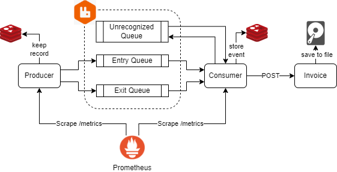
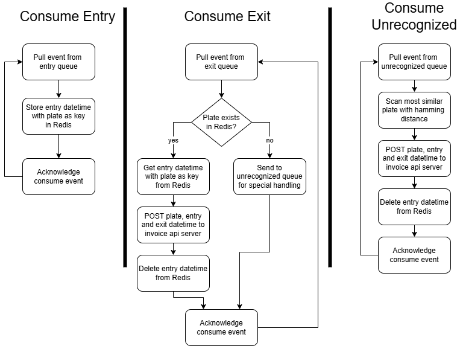

# Skylo Parking Assignment

### Overall Architecture


### Producer flow


### Consumer flow


# Use Case
Most of the shopping malls nowadays have automated parking metering. There are cameras that track the entry and exit of the vehicle, and provide a realtime summary of vehicle time spent in parking lot. This in turn is used to send parking invoices to the vehicle owner.


The task here is to simulate this use case using GoLang, Python/Rust, Redis, RabbitMQ and Docker:


# Design and implementation

1. Configure RabbitMQ with two queues - one for tracking vehicle entry events and another one for tracking vehicle exit events

2. To simulate vehile entry, create a generator service in GoLang that generates events with a json payload having at least below mentioned fields:
  ```
  {
    "id": <identifier for the event>,
    "vehicle_plate": <alphanumeric registration id of the vehicle>,
    "entry_date_time": <date time in UTC>
  }
  ```

3. Publish above events to RabbitMQ queue for tracking entry events.

4. To simulate vehile exit, create a generator service in GoLang that generates events with a json payload having at least below mentioned fields:
  ```
  {
    "id": <identifier for the event>,
    "vehicle_plate": <alphanumeric registration id of the vehicle>,
    "exit_date_time": <date time in UTC>,
  }
  ```

5. Publish above events to RabbitMQ queue for tracking exit events.

6. 80% of the exit events generated should match a vehicle plate that has a corresponding entry event. Remianing exit events should have no correspnding entry events. This is to simulate the case where the mall camera did not record vehicle entry event, perhaps because one or more of the vehicle plates were not clean/clear enough!

7. Design and implement a backend service in GoLang that consumes events from above services and maintains a record of vehicle entry and exit times.

8. Once the exit event is triggered, backend service invokes a REST API to a Python/Rust server that writes summary of vehicle, entry, exit and duration into a local file.

9. For all your storage needs, use a single redis instance for all services. DBs in redis should be different for each service, if used.

10. Include basic statistics in services to measure latency of event processing. Extra points for using open source tools such as prometheus, signoz etc.

# Deployment

1. Deploy all the services mentioned above (generator services, backend service, rest api server, redis and rabbitmq) as docker containers. Extra points for usage of docker-compose

2. Provide configuration parameters for the service, although they don't have to be loaded dynamically, i.e., service can be stopped and restarted to use new configuration. Use creative imagination for possible configuration parameters and ways to inject configuration to the service.

3. All events and services are asynchronous.

# Deliverables

1. Store all code in a personal github repository and share the link. This could include as an example code, docker file and docker compose

2. Be prepared to present a 3-slide deck that summarises the design, implementation and performance observations using telemtry implemented in the services. Only capture relevent highlights here, with references to code files and functions in code, if needed.

3. Be prepared to run the docker containers locally in your machine to demonstrate the use case including summary records written to the file. All services should be started at the same time.

